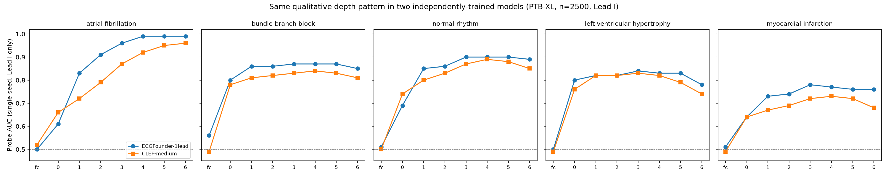

# Preliminary results

Status: early, from a partial sample while the full PTB-XL download finishes — treat everything
here as a first pass to sanity-check the research plan's direction, not final numbers for a
paper. Reproducibility details for each result are given so they can be rerun at full scale.

## Setup

- **Data**: a reproducible random sample of **2,500 / 21,801** PTB-XL records (`numpy.random.
  RandomState(0)`, no replacement) — chosen because it's enough for stable probe statistics and
  can be fetched in minutes, while the full dataset download is bandwidth-limited to ~2+ hours in
  this environment. Every number below should be rerun on the full dataset before anything is
  claimed in a paper; 2,500 records is a first look, not a final sample size.
- **Concepts**: the 5 target diagnoses (atrial fibrillation, bundle branch block, normal rhythm,
  left ventricular hypertrophy, myocardial infarction), labeled from `scp_statements.csv` per
  [research-plan.md](research-plan.md).
- **Models**: ECGFounder (12-lead, for the depth profile; 1-lead for the cross-model comparison)
  and CLEF-medium (1-lead only). Both are the exact same `Net1D` backbone config — see the
  caveat below, it matters for how to read the cross-model result.
- **Probe**: logistic regression on mean-pooled layer activations, 5 (ECGFounder depth profile)
  or 3 (cross-model) random train/test splits, mean ± std AUC reported.
- Raw numbers behind every table here are in [`results/preliminary_2500sample.json`](../results/preliminary_2500sample.json).

## Finding 1 — a depth-dependent decodability pattern that replicates across two independently-trained models

Single-lead (Lead I) probe AUC by depth, ECGFounder vs. CLEF, same 2,500 records, one seed each:

| Concept | ECGFounder peak (AUC) | CLEF peak (AUC) | ECGFounder peak→final drop | CLEF peak→final drop |
|---|---|---|---|---|
| Atrial fibrillation | stage 5 (0.993±0.001) | stage 6/last (0.962±0.007) | **0.001** | **0.000** |
| Bundle branch block | stage 5 (0.874±0.035) | stage 4 (0.837±0.010) | 0.024 | 0.027 |
| Normal rhythm | stage 5 (0.902±0.004) | stage 4 (0.889±0.011) | 0.014 | 0.043 |
| Left ventricular hypertrophy | stage 3 (0.835±0.019) | stage 3 (0.828±0.013) | 0.057 | 0.084 |
| Myocardial infarction | stage 3 (0.777±0.012) | stage 4 (0.730±0.018) | 0.021 | 0.054 |

(3-seed mean±std per point; full per-layer table for both models is in the appendix at the
bottom of this file.)

This is the most robust finding so far because it's not a single-model quirk: **both models peak
within one stage of each other for every concept, and agree exactly on which concept is the
outlier.** Atrial fibrillation is the only one of the 5 with essentially zero decodability loss
between its peak and the final layer, in *both* models — every other concept peaks around
stage 3-4 (of 6) and loses a real amount (2-9 points) by the output layer, in *both* models.

A plausible clinical reading: AFib is a **rhythm** abnormality — diagnosing it requires
integrating irregularity across many beats, which needs the large temporal receptive field only
the later, more-pooled layers have. BBB, LVH, and MI are largely **morphology** abnormalities
(QRS widening, voltage amplitude, ST/T-wave shape) — comparatively local, per-beat features that
later pooling stages may be blurring rather than sharpening, at least linearly. If that
distinction holds up, it's a concrete, mechanistic, and citable claim about *why* representation
quality is concept-dependent, not just an empirical curve.

There's also a more subtle point worth keeping for the paper: this functional pattern (which
depth is "best" for which concept) replicates across the two models even though — see Finding 2
— their representations are *not* geometrically similar (low CKA) at any of those depths. Shared
structure shows up at the level of "where is this concept best read out," not at the level of
"do the two models represent it the same way." That distinction is worth stating explicitly
rather than collapsing into a single "shared or not" verdict.

*Caveats*: 3 train/test seeds for this cross-model table (vs. 5 for the fuller ECGFounder-12-lead
table below) and n=2,500 of 21,801 — the peak-to-final drops for LVH/MI/BBB/NORM are comfortably
bigger than their seed-to-seed std in both models, so this reads as real rather than noise, but
it isn't a formally significance-tested claim yet. Single-lead numbers are naturally a bit
lower/noisier than the 12-lead ones below since each model sees less information.

### Supporting result: full 12-lead, 5-seed ECGFounder depth profile

| Concept | Peak layer | Peak AUC | Final-layer AUC |
|---|---|---|---|
| Atrial fibrillation | stage 6 (last) | 0.995 | 0.995 |
| Bundle branch block | stage 3 (of 6) | 0.963 | 0.957 |
| Normal rhythm | stage 5 (of 6) | 0.946 | 0.942 |
| Left ventricular hypertrophy | stage 3 (of 6) | 0.904 | 0.883 |
| Myocardial infarction | stage 4 (of 6) | 0.895 | 0.873 |

Same qualitative pattern with the full 12-lead signal and proper error bars (5 seeds): AFib
peaks last, everything else peaks mid-network. This is ECGFounder only, but with more
information (12 leads) and more statistical care than the cross-model table above — the two
are consistent with each other.

## Finding 2 — ECGFounder and CLEF show low representational similarity at matched depths, despite an identical backbone

Linear CKA (Kornblith et al., 2019) between ECGFounder-1lead and CLEF-medium activations, same
2,500 Lead-I signals, at architecturally-matched hook points:

| Layer | first_conv | stage 0 | stage 1 | stage 2 | stage 3 | stage 4 | stage 5 | stage 6 |
|---|---|---|---|---|---|---|---|---|
| CKA | 0.136 | 0.175 | 0.330 | 0.225 | 0.157 | 0.115 | 0.178 | 0.246 |

CKA=1 means the two representations are identical up to rotation/scaling; CKA=0 means unrelated.
0.11-0.33 is low — notably far from the high similarity you'd typically expect between two copies
of the *same* architecture. That's the interesting part: **ECGFounder and CLEF are the identical
`Net1D` configuration** (see caveat below) trained with different objectives (ECGFounder:
supervised 150-class diagnostic classification; CLEF: SimCLR-style contrastive pretraining on
MIMIC-IV-ECG) and different data. Representational similarity stays low across the entire depth
of the network even though the architecture is not a confound here — which points toward
training objective/data, not architecture, as the dominant factor shaping what these models'
internals look like. That's a substantive, on-thesis preliminary result for the research plan's
central question.

**Important caveat — read before citing this anywhere**: because both models are the same
backbone, this result cannot yet support a general "representations converge across
architectures" or "diverge across architectures" claim in either direction — it's a same-
architecture, different-objective comparison. To make an architecture-independent claim, the
next step is adding a third, architecturally distinct model (e.g. ECG-JEPA — MIT, ungated,
plausibly a different backbone; or a transformer-based one) and checking whether the same low-CKA
pattern holds, or whether ECGFounder/CLEF are unusually similar to *each other* (via their shared
architecture) relative to a genuinely different design. Right now we only have two points and
they happen to share a backbone — that's a real limitation of this first pass, not a footnote.

## What's not done yet

- Full-dataset numbers (waiting on the PTB-XL download; script is identical, just point it at
  the complete `data/raw/ptb-xl/` once available)
- A third, architecturally distinct model for the CKA comparison (see caveat above) — this is
  the main open gap for turning Finding 2 into an architecture-independence claim
- Any SAE training, seed-reproducibility, or causal-ablation results — none of the SAE/subspace
  machinery in `analysis/subspace.py` has been exercised yet, only implemented
- Formal statistical testing of the peak-vs-final-layer gaps (currently point estimates with
  seed-split std, not a significance test across a resampled test set)

## Suggested next steps toward a paper

1. Let the full PTB-XL download finish and rerun both analyses at full scale (mechanical, no new
   code needed)
2. Add a third, architecturally distinct model (ECG-JEPA is the easiest next candidate — MIT,
   ungated) to turn Finding 2 into an actual architecture-independence test
3. Train a first small SAE on one layer/model and check whether any individual features
   correlate with the 5 concepts — the more novel angle from the original research plan, not yet
   attempted
4. Finding 1 (the cross-model depth-pattern replication) is arguably strong enough to anchor a
   paper's opening result even before the third-model/SAE work lands: "linear decodability of
   clinical ECG concepts peaks before the final layer for morphology-based diagnoses but not for
   a rhythm-based one (AFib), and this pattern replicates across two independently-trained
   models despite their representations having low geometric similarity (CKA) at every depth."

## Appendix: full per-layer probe tables (single Lead I, 3-seed mean±std, n=2,500)

**ECGFounder-1lead**

| Concept | first_conv | stage 0 | stage 1 | stage 2 | stage 3 | stage 4 | stage 5 | stage 6 |
|---|---|---|---|---|---|---|---|---|
| Atrial fibrillation | 0.503±.037 | 0.610±.036 | 0.826±.024 | 0.907±.032 | 0.956±.013 | 0.987±.002 | 0.993±.001 | 0.992±.002 |
| Bundle branch block | 0.555±.027 | 0.801±.013 | 0.864±.017 | 0.863±.018 | 0.872±.014 | 0.873±.014 | 0.874±.035 | 0.850±.028 |
| Normal rhythm | 0.508±.009 | 0.693±.010 | 0.845±.013 | 0.856±.012 | 0.898±.006 | 0.898±.005 | 0.902±.004 | 0.888±.007 |
| Left ventricular hypertrophy | 0.499±.035 | 0.799±.019 | 0.824±.014 | 0.820±.016 | 0.835±.019 | 0.830±.017 | 0.829±.018 | 0.778±.022 |
| Myocardial infarction | 0.509±.017 | 0.643±.006 | 0.734±.003 | 0.738±.006 | 0.777±.012 | 0.766±.009 | 0.763±.018 | 0.756±.009 |

**CLEF-medium**

| Concept | first_conv | stage 0 | stage 1 | stage 2 | stage 3 | stage 4 | stage 5 | stage 6 |
|---|---|---|---|---|---|---|---|---|
| Atrial fibrillation | 0.520±.036 | 0.664±.015 | 0.719±.026 | 0.793±.023 | 0.873±.027 | 0.922±.027 | 0.950±.013 | 0.962±.007 |
| Bundle branch block | 0.487±.030 | 0.785±.008 | 0.810±.011 | 0.820±.017 | 0.829±.017 | 0.837±.010 | 0.835±.028 | 0.810±.034 |
| Normal rhythm | 0.498±.006 | 0.745±.012 | 0.803±.007 | 0.826±.004 | 0.865±.006 | 0.889±.011 | 0.879±.007 | 0.846±.013 |
| Left ventricular hypertrophy | 0.494±.021 | 0.762±.020 | 0.817±.012 | 0.822±.007 | 0.828±.013 | 0.825±.011 | 0.795±.013 | 0.744±.009 |
| Myocardial infarction | 0.494±.021 | 0.639±.033 | 0.670±.026 | 0.690±.023 | 0.716±.021 | 0.730±.018 | 0.717±.010 | 0.676±.014 |
