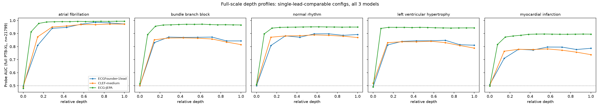
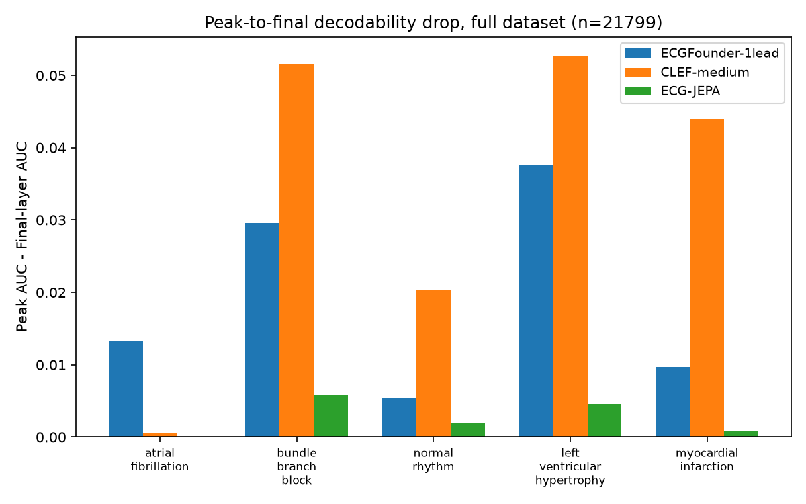
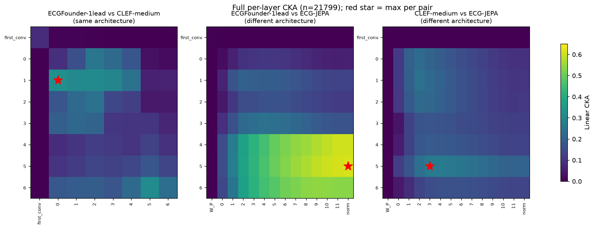

# Preliminary results

Status: full-dataset results for the depth-profile and cross-model comparisons (n=21,799, all of
PTB-XL). The SAE results (Finding 3) are still on a 2,500-record sample — flagged where relevant.
This version **supersedes and in one case corrects** an earlier 2,500-record preview; see
"What changed from the 2,500-sample preview" below for exactly what didn't hold up. Still not
"final" in the sense of being significance-tested or peer-reviewed — read as a solid first pass.

## Setup

- **Data**: the complete PTB-XL 1.0.3 dataset, 21,799 records (2 fewer than the commonly cited
  21,801 — unexplained, negligible).
- **Concepts**: the 5 target diagnoses (atrial fibrillation, bundle branch block, normal rhythm,
  left ventricular hypertrophy, myocardial infarction), labeled from `scp_statements.csv` per
  [research-plan.md](research-plan.md).
- **Models**: ECGFounder (12-lead, and a 1-lead variant for cross-model comparability),
  CLEF-medium (1-lead only), and **ECG-JEPA** (8-lead: I, II, V1-V6) — confirmed by direct
  inspection to be a real transformer (attention blocks, zero convolutions), unlike
  ECGFounder/CLEF which are the identical `Net1D` CNN config (see [models.md](models.md)).
  Each model gets its own native input configuration computed from the same underlying
  recordings — CKA and cross-model probing only require the same *examples*, not identical
  input bytes, so this is methodologically fine, but it does mean ECGFounder-12lead sees more
  information than the other three.
- **Probe**: logistic regression (standardized features, `class_weight="balanced"`,
  `liblinear`), 5 random train/test splits, mean ± std AUC reported.
- Raw numbers behind every table here are in
  [`results/full_scale_21799sample.json`](../results/full_scale_21799sample.json). The earlier
  2,500-sample numbers are preserved in
  [`results/preliminary_2500sample.json`](../results/preliminary_2500sample.json) for the
  historical comparison below.

## Finding 1 — depth-dependent decodability is real and robust, but *which* concept declines late is model-specific, not universal

Peak-to-final-layer AUC drop, single-lead-comparable configs (ECGFounder-1lead, CLEF-medium,
ECG-JEPA), full dataset:

| Concept | ECGFounder-1lead drop | CLEF-medium drop | ECG-JEPA drop |
|---|---|---|---|
| Atrial fibrillation | 0.013 | **0.001** | 0.000 |
| Bundle branch block | 0.030 | **0.052** | 0.006 |
| Normal rhythm | 0.005 | 0.020 | 0.002 |
| Left ventricular hypertrophy | 0.038 | **0.053** | 0.005 |
| Myocardial infarction | 0.010 | **0.044** | 0.001 |

What's robust: **all three models show the same broad shape** — near-chance at the first layer,
a sharp rise through the early-mid layers, and a plateau by the back half of the network. That
basic "representations build up through depth then saturate" pattern replicates across all three
models, including the architecturally distinct ECG-JEPA, and is a solid, mechanistic-flavored
finding on its own.

What's **not** robust: the earlier 2,500-record finding that "AFib is the one concept that keeps
improving to the final layer while every other concept declines" does not hold uniformly.
**CLEF shows it clearly** (real, meaningful drops of 2-5 points for BBB/NORM/LVH/MI, ~0 for
AFib). **ECGFounder shows a much weaker version** of it (small drops for everyone, 0.5-3.8
points, without a clean AFib-is-different story — for the 12-lead variant, normal rhythm is
actually the most stable concept, not AFib). **ECG-JEPA shows almost no decline for any
concept** — everything saturates and stays flat (drops of 0.000-0.006 across the board).

A plausible explanation that's actually falsifiable rather than just a story: **ECGFounder and
CLEF are CNNs that progressively downsample the temporal axis through strided convolution**
(their late layers really do see less temporal resolution — verified shapes go
2500→1250→625→...→20 samples across stages). **ECG-JEPA is a transformer that preserves its full
token sequence at every layer** (attention re-weights content but never pools away positions).
If late-layer decodability loss is caused by genuine information loss from temporal pooling,
that predicts exactly what's observed: the two CNNs lose some ground late, the non-pooling
transformer doesn't.

**One specific test of this that turned out not to work, noted so it isn't tried again the same
way**: correlating each ECGFounder stage's pooling ratio against its AUC change doesn't work as
a within-model test, because ECGFounder pools by an essentially constant ~2x ratio at *every*
stage transition (verified: 0.500, 0.500, 0.501, 0.502, 0.503, 0.506, 0.500) — there's no
variation across stages to correlate against. The real evidence for the pooling explanation is
the model-level contrast already described above (poolers decline, the non-pooler doesn't), not
a within-model dose-response curve. A real causal test would need either an architecture with
varying pool ratios across depth (none of the three models here have that) or trained ablations
that vary pooling directly — worth flagging as a genuine next step rather than something
answerable with the models already on hand.

## Finding 2 — the architecturally different model pair shows *higher* similarity than the same-architecture pair, confirmed across the full layer grid

Full pairwise linear CKA (Kornblith et al., 2019) — every one of ECGFounder-1lead's/CLEF-medium's
8 layers against every one of the other model's layers in each pair (112 cells for the CNN-CNN
pair, 8×14=112 for each CNN-vs-ECG-JEPA pair), full dataset, same-Lead-I (or native 8-lead for
ECG-JEPA) inputs — not just the 3 hand-picked depth points from the first pass:

| Pair | Max CKA (location) | Mean CKA across all cells |
|---|---|---|
| ECGFounder-1lead vs. CLEF-medium (**same architecture**) | 0.328 (stage 1 / stage 0) | 0.122 |
| ECGFounder-1lead vs. ECG-JEPA (**different architecture**) | **0.610** (stage 5 / `norm`) | **0.228** |
| CLEF-medium vs. ECG-JEPA (**different architecture**) | 0.268 (stage 5 / block 3) | 0.128 |

This is the most counter-intuitive result in the project so far, and the full sweep makes it
*stronger*, not weaker, than the initial 3-point check: the ECGFounder/ECG-JEPA pair — two
genuinely different architectures — has both a higher peak (0.610 vs. 0.328) and roughly
**double the average similarity** (0.228 vs. 0.122-0.128) across the entire layer grid compared
to either pair involving CLEF. That rules out "the 3-point check happened to land on a lucky
cell" as an explanation. It also revises one detail from the first pass: the best-aligned layers
aren't at matching depth indices (ECGFounder's peak alignment with CLEF is stage 1↔stage 0, not
same-index-to-same-index) — worth remembering before assuming same-index layers are the right
thing to compare across models in general.

If this holds up under further scrutiny, it argues against a simple "architecture determines
representation" story and for something else being the dominant factor — though ECGFounder and
ECG-JEPA also differ in training data, so this doesn't cleanly isolate architecture as *the*
explanation on its own; it rules out "shared architecture is sufficient for shared
representation" (ECGFounder/CLEF already showed that) and now additionally suggests shared
architecture isn't *necessary* for higher similarity either. All three pairs still sit well
below what you'd expect from two runs of the truly same model — "similar" here is relative, not
high in an absolute sense.

**Caveats**: CKA between models with different native input richness (12 vs. 1 vs. 8 leads,
effectively) is a real but imperfect comparison — some of what's measured could reflect input
information differences rather than purely learned representation differences. The full CKA
matrices are in
[`results/full_layer_cka_21799sample.json`](../results/full_layer_cka_21799sample.json).

## Finding 3 — a first SAE pass does *not* yet show the hypothesized feature-vs-subspace asymmetry (still on the 2,500-record sample)

Trained top-k SAEs (k=32) on ECGFounder's `stage_list.3` activations (400-dim), 2,500 PTB-XL
records, 5 random seeds:

- **Reconstruction**: explained variance 0.839-0.846 across seeds — consistent, real structure.
- **Individual feature stability**: mean best-cosine-match across seed pairs = **0.18**, zero
  features exceed 0.8 similarity with their best match in another seed.
- **Subspace stability**: principal angles between the top-20 PCA subspaces of the two SAEs'
  decoder directions average **77.6°** (90° = fully orthogonal) — not clearly more stable than
  individual features.

Ruled out dictionary overcompleteness as the explanation (same numbers at 1x/2x/4x the input
dimension: feature match 0.171/0.174/0.180, subspace angle 76.5°/77.2°/77.9°).

**How to read this honestly**: doesn't confirm the project's primary hypothesis in its strong
form, at least not with this operationalization, on this layer, at this scale. Most likely
explanations, not mutually exclusive: (1) 2,500 examples / 150-200 epochs may be too little for
SAEs to converge to a well-defined solution — this needs rechecking on the full 21,799-record
dataset with substantially more training before concluding anything; (2) "PCA of decoder
vectors" may not match how the SAE-reproducibility literature (Gerasimov et al., cited in
[related-work.md](related-work.md)) operationalizes subspace stability — they generally restrict
to partially-matched features first. Both are listed as next steps below and neither has been
tried yet.

## Finding 3b — a few SAE features correlate with specific concepts (same 2,500-record caveat)

| Concept | Top feature (r) | 2nd (r) | 3rd (r) |
|---|---|---|---|
| Atrial fibrillation | 876 (-0.32) | 730 (-0.28) | 815 (-0.28) |
| Bundle branch block | 437 (+0.52) | 351 (+0.43) | 876 (-0.23) |
| Normal rhythm | 351 (-0.45) | 1132 (+0.41) | 901 (+0.39) |
| Left ventricular hypertrophy | 465 (+0.34) | 144 (-0.25) | 815 (-0.22) |
| Myocardial infarction | 1132 (-0.36) | 351 (+0.28) | 901 (-0.25) |

Feature 351 shows up for 3 of 5 concepts, feature 876 for 2 — worth checking whether those are
genuinely polysemantic or an artifact of label co-occurrence. Needs a held-out check before
being more than a lead.

## What changed from the 2,500-sample preview — read this before citing the earlier numbers

The 2,500-record version of this document reported: "atrial fibrillation is the only concept
that doesn't decline from its peak to the final layer, and this replicates identically across
ECGFounder and CLEF." At full scale (21,799 records):

- **CLEF**: this pattern held up and got clearer (AFib drop 0.001, others 0.02-0.05).
- **ECGFounder**: the pattern mostly washed out — drops shrank across the board (max 0.038 vs.
  up to 0.084 at n=2,500) and AFib is no longer uniquely stable (normal rhythm is, for the
  12-lead variant).
- **ECG-JEPA** (new): shows almost no late-layer decline for any concept at all — a third,
  different pattern, not a replication of either of the other two.

The honest interpretation is that the small-sample "clean cross-model replication" was partly
noise — real enough to be worth following up (which is what led to running this at full scale
and adding a third model), but not the tight universal law it looked like at n=2,500. This is
also why the earlier CKA range (0.11-0.33) held up well at full scale — that number was less
sensitive to sample size than the peak-location comparison was, and turned out to be the more
durable part of the original finding. The new full-scale CKA also uncovered Finding 2's
counter-intuitive architecture result, which wasn't visible with only two (same-architecture)
models to compare.

Practical lesson for how to run the next round of experiments here: peak-layer identification
from probe curves is more sample-sensitive than CKA is — don't trust a "which layer is best"
claim from a small sample the way you can trust a similarity-score claim from the same sample.

## What's not done yet

- SAE results (Finding 3, 3b) are still on the 2,500-record sample — full-scale rerun with more
  training epochs is the natural next step, per the Finding 3 caveats (see
  [paper-outline.md](paper-outline.md) for the scope call to leave this out of the ML4H
  submission for now)
- Held-out validation of the Finding 3b feature-concept correlations
- ~~A full per-layer CKA sweep across all three models~~ — done, see Finding 2 above
- A causal (not just correlational) test of the pooling-causes-decline explanation in Finding 1
  — the within-ECGFounder correlation doesn't work (pooling ratio is constant across its
  stages, see Finding 1), so this needs either a varying-pool-ratio architecture or a trained
  ablation, neither of which exists yet
- Formal statistical testing (the drops and CKA differences look real relative to their seed
  variability, but nothing here is a formal significance test yet)

## Suggested next steps toward a paper

1. Start drafting actual prose against [paper-outline.md](paper-outline.md) — Findings 1 and 2
   are both now at full dataset scale with reasonably thorough checks (Finding 1 self-corrected
   on the pooling-ratio test, Finding 2 confirmed and strengthened by the full layer sweep)
2. Check ML4H's page limit/template and do a related-work pass specifically on whether the
   cross-architecture CKA result has independent precedent (see paper-outline.md's checklist)
3. SAE stability (Finding 3) is scoped out of the current paper plan — revisit only if there's
   spare time after 1-2, per [paper-outline.md](paper-outline.md)
4. Given how much the peak-location story changed between 2,500 and 21,799 records, be wary of
   reading too much into any further small-sample exploratory run without a full-scale check
   before it goes in a paper

## Appendix A: full per-layer probe tables, full dataset (n=21,799)

**ECGFounder-12lead**

| Concept | first_conv | stage 0 | stage 1 | stage 2 | stage 3 | stage 4 | stage 5 | stage 6 |
|---|---|---|---|---|---|---|---|---|
| Atrial fibrillation | 0.562 | 0.854 | 0.947 | 0.966 | 0.983 | 0.990 | 0.980 | 0.986 |
| Bundle branch block | 0.626 | 0.917 | 0.967 | 0.968 | 0.975 | 0.976 | 0.959 | 0.958 |
| Normal rhythm | 0.678 | 0.886 | 0.929 | 0.931 | 0.945 | 0.948 | 0.945 | 0.947 |
| Left ventricular hypertrophy | 0.552 | 0.860 | 0.910 | 0.920 | 0.928 | 0.931 | 0.904 | 0.905 |
| Myocardial infarction | 0.634 | 0.829 | 0.890 | 0.906 | 0.923 | 0.929 | 0.921 | 0.922 |

**ECGFounder-1lead**

| Concept | first_conv | stage 0 | stage 1 | stage 2 | stage 3 | stage 4 | stage 5 | stage 6 |
|---|---|---|---|---|---|---|---|---|
| Atrial fibrillation | 0.499 | 0.809 | 0.940 | 0.947 | 0.972 | 0.987 | 0.981 | 0.973 |
| Bundle branch block | 0.500 | 0.831 | 0.873 | 0.870 | 0.871 | 0.873 | 0.843 | 0.843 |
| Normal rhythm | 0.500 | 0.808 | 0.882 | 0.872 | 0.897 | 0.898 | 0.886 | 0.893 |
| Left ventricular hypertrophy | 0.492 | 0.813 | 0.840 | 0.844 | 0.844 | 0.848 | 0.814 | 0.810 |
| Myocardial infarction | 0.508 | 0.710 | 0.780 | 0.774 | 0.797 | 0.796 | 0.778 | 0.787 |

**CLEF-medium**

| Concept | first_conv | stage 0 | stage 1 | stage 2 | stage 3 | stage 4 | stage 5 | stage 6 |
|---|---|---|---|---|---|---|---|---|
| Atrial fibrillation | 0.490 | 0.875 | 0.950 | 0.958 | 0.969 | 0.969 | 0.973 | 0.972 |
| Bundle branch block | 0.501 | 0.852 | 0.866 | 0.867 | 0.864 | 0.858 | 0.835 | 0.815 |
| Normal rhythm | 0.509 | 0.872 | 0.882 | 0.883 | 0.890 | 0.886 | 0.880 | 0.870 |
| Left ventricular hypertrophy | 0.519 | 0.830 | 0.837 | 0.837 | 0.841 | 0.830 | 0.808 | 0.788 |
| Myocardial infarction | 0.501 | 0.764 | 0.779 | 0.778 | 0.782 | 0.772 | 0.757 | 0.738 |

**ECG-JEPA** (W_P, blocks 0-11, norm)

| Concept | W_P | 0 | 1 | 2 | 3 | 4 | 5 | 6 | 7 | 8 | 9 | 10 | 11 | norm |
|---|---|---|---|---|---|---|---|---|---|---|---|---|---|---|---|
| Atrial fibrillation | 0.480 | 0.913 | 0.978 | 0.989 | 0.991 | 0.991 | 0.991 | 0.994 | 0.992 | 0.994 | 0.994 | 0.994 | 0.994 | 0.994 |
| Bundle branch block | 0.513 | 0.893 | 0.956 | 0.966 | 0.967 | 0.970 | 0.971 | 0.971 | 0.972 | 0.969 | 0.967 | 0.968 | 0.967 | 0.966 |
| Normal rhythm | 0.508 | 0.898 | 0.942 | 0.948 | 0.949 | 0.950 | 0.951 | 0.951 | 0.952 | 0.951 | 0.950 | 0.949 | 0.950 | 0.950 |
| Left ventricular hypertrophy | 0.490 | 0.939 | 0.948 | 0.948 | 0.948 | 0.946 | 0.948 | 0.947 | 0.944 | 0.943 | 0.942 | 0.943 | 0.943 | 0.943 |
| Myocardial infarction | 0.498 | 0.817 | 0.873 | 0.881 | 0.887 | 0.894 | 0.896 | 0.896 | 0.896 | 0.895 | 0.894 | 0.895 | 0.896 | 0.896 |

*(All values are 5-seed means; std omitted from this table for space — see the JSON for exact
per-seed std.)*

## Appendix B: the superseded 2,500-record preview (kept for the record, see caveat above)

The original, smaller-sample cross-model table (ECGFounder vs. CLEF only, no ECG-JEPA) reported
peaks at stage 3-6 with drops up to 0.084 and a clean "AFib never declines" story. Full values
are in [`results/preliminary_2500sample.json`](../results/preliminary_2500sample.json) — not
reproduced here to avoid the appearance that both versions are equally current. Use the full
dataset tables in Appendix A instead.
