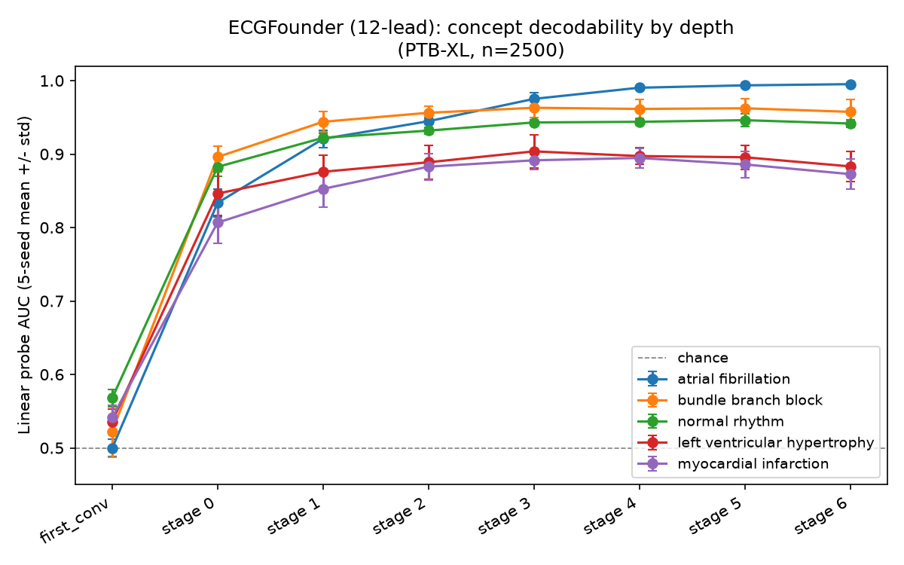

# Preliminary results

Status: early, from a partial sample while the full PTB-XL download finishes — treat everything
here as a first pass to sanity-check the research plan's direction, not final numbers for a
paper. Reproducibility details for each result are given so they can be rerun at full scale.

## Setup

- **Data**: a reproducible random sample of **2,500 / 21,801** PTB-XL records (`numpy.random.
  RandomState(0)`, no replacement) — chosen because it's enough for stable probe statistics and
  can be fetched in minutes, while the full dataset download is bandwidth-limited to ~2+ hours in
  this environment. Every number below should be rerun on the full dataset before anything is
  claimed in a paper; 2,500 records is a first look, not a final sample size.
- **Concepts**: the 5 target diagnoses (atrial fibrillation, bundle branch block, normal rhythm,
  left ventricular hypertrophy, myocardial infarction), labeled from `scp_statements.csv` per
  [research-plan.md](research-plan.md).
- **Models**: ECGFounder (12-lead, for the depth profile; 1-lead for the cross-model comparison)
  and CLEF-medium (1-lead only). Both are the exact same `Net1D` backbone config — see the
  caveat below, it matters for how to read the cross-model result.
- **Probe**: logistic regression on mean-pooled layer activations, 5 (ECGFounder depth profile)
  or 3 (cross-model) random train/test splits, mean ± std AUC reported.

## Finding 1 — concept decodability is depth-dependent, and not always maximal at the last layer

| Concept | Peak layer | Peak AUC | Final-layer AUC |
|---|---|---|---|
| Atrial fibrillation | stage 6 (last) | 0.995 | 0.995 |
| Bundle branch block | stage 3 (of 6) | 0.963 | 0.957 |
| Normal rhythm | stage 5 (of 6) | 0.946 | 0.942 |
| Left ventricular hypertrophy | stage 3 (of 6) | 0.904 | 0.883 |
| Myocardial infarction | stage 4 (of 6) | 0.895 | 0.873 |

4 of 5 concepts peak **before** the final layer and then decline slightly (LVH and MI drop about
2 points from their peak to the last stage); only atrial fibrillation keeps improving monotonically
all the way to the output. If this holds at full scale, it suggests ECGFounder's last couple of
layers specialize toward whatever its own 150-class pretraining objective needs, at some cost to
linear decodability of concepts that aren't central to that objective — i.e. "closest to the
output" is not the same as "most linearly accessible" for every concept. That's directly relevant
to the research plan's premise that representation quality/location is method- and
concept-dependent, not just architecture-dependent.

*Caveat*: peak-vs-final AUC differences (2-4 points) are close to the seed-to-seed std at those
layers — this reads as a real pattern (it's consistent across 3 of 5 concepts) but isn't yet a
statistically tested claim.

## Finding 2 — ECGFounder and CLEF show low representational similarity at matched depths, despite an identical backbone

Linear CKA (Kornblith et al., 2019) between ECGFounder-1lead and CLEF-medium activations, same
2,500 Lead-I signals, at architecturally-matched hook points:

| Layer | first_conv | stage 0 | stage 1 | stage 2 | stage 3 | stage 4 | stage 5 | stage 6 |
|---|---|---|---|---|---|---|---|---|
| CKA | 0.136 | 0.175 | 0.330 | 0.225 | 0.157 | 0.115 | 0.178 | 0.246 |

CKA=1 means the two representations are identical up to rotation/scaling; CKA=0 means unrelated.
0.11-0.33 is low — notably far from the high similarity you'd typically expect between two copies
of the *same* architecture. That's the interesting part: **ECGFounder and CLEF are the identical
`Net1D` configuration** (see caveat below) trained with different objectives (ECGFounder:
supervised 150-class diagnostic classification; CLEF: SimCLR-style contrastive pretraining on
MIMIC-IV-ECG) and different data. Representational similarity stays low across the entire depth
of the network even though the architecture is not a confound here — which points toward
training objective/data, not architecture, as the dominant factor shaping what these models'
internals look like. That's a substantive, on-thesis preliminary result for the research plan's
central question.

**Important caveat — read before citing this anywhere**: because both models are the same
backbone, this result cannot yet support a general "representations converge across
architectures" or "diverge across architectures" claim in either direction — it's a same-
architecture, different-objective comparison. To make an architecture-independent claim, the
next step is adding a third, architecturally distinct model (e.g. ECG-JEPA — MIT, ungated,
plausibly a different backbone; or a transformer-based one) and checking whether the same low-CKA
pattern holds, or whether ECGFounder/CLEF are unusually similar to *each other* (via their shared
architecture) relative to a genuinely different design. Right now we only have two points and
they happen to share a backbone — that's a real limitation of this first pass, not a footnote.

## What's not done yet

- Full-dataset numbers (waiting on the PTB-XL download; script is identical, just point it at
  the complete `data/raw/ptb-xl/` once available)
- CLEF-side probe AUCs for the same 5 concepts (script `cross_model_compare.py` pattern in
  [examples/](../examples/) once cleaned up — was still running as of this writeup)
- A third, architecturally distinct model for the CKA comparison (see caveat above)
- Any SAE training, seed-reproducibility, or causal-ablation results — none of the SAE/subspace
  machinery in `analysis/subspace.py` has been exercised yet, only implemented
- Statistical testing of the peak-vs-final-layer gap in Finding 1 (currently just point estimates
  with seed-split std, not a significance test)

## Suggested next steps toward a paper

1. Let the full PTB-XL download finish and rerun both analyses at full scale (mechanical, no new
   code needed)
2. Add a third, architecturally distinct model (ECG-JEPA is the easiest next candidate — MIT,
   ungated) to turn Finding 2 into an actual architecture-independence test
3. Train a first small SAE on one layer/model and check whether any individual features
   correlate with the 5 concepts — the more novel angle from the original research plan, not yet
   attempted
4. If Finding 1's pattern holds at full scale, it's a plausible standalone contribution even
   before the cross-model/SAE work lands: "linear decodability of clinical concepts in ECG
   foundation models peaks before the final layer for most (not all) concepts"
